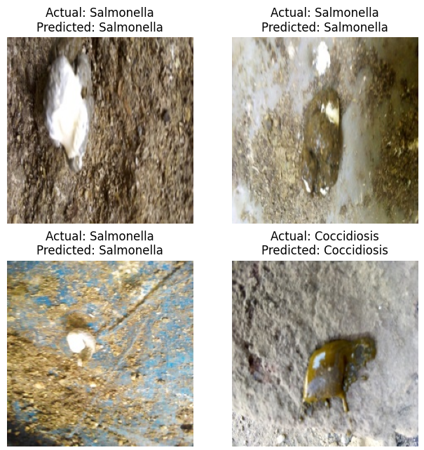

# Chicken disease detection based on faeces

Chickens in commercial broiler farms suffer from a variety of disease. Given the density of the chicken population (typically 14-17 birds per m$^2$), these diseases spread quickly. And given the amount of chickens per barn (30-50,000) and the number of hours per day available for a barn (probably <4h), there is a need to detect illnesses very fast and provide a remedy if possible.

Illnesses in chicken barns can be roughly classified into
- Respiratory diseases (e.g. cough, flu)
- Skeleton-based diseases (e.g. lameness, pododermatitis)
- Diseases that affect the digestive tract

Diseases that affect the digestive tract have by nature an impact on the conversion of feed into meat and are therefore very relevant for the well-being of the bird as well as for the financial performance of the barn.

In a public dataset published on Kaggle (https://www.kaggle.com/datasets/allandclive/chicken-disease-1) 224x224 images have been collected in small to medium scale chicken farms in the Arusha and Kilimanjaro regions in Tanzania between September 2020 and February 2021. The dataset provides about 8000 annotated images in 4 classes: "Healthy", "Coccidiosis" ,"New Castle Disease", and "Salmonella".

The three diseases coccidiosis, New Castle disease and salmonella are the most common diseases that affect the digestive tract. Many farms vaccinate against the coccidiosis and New Castle disease because of their very strong impact on the birds. Salmonella on the other hand is the most critical public health issue arising from chicken production. Salmonella hospitalizes and kills more people in the U.S. than any other foodborne pathogen, with about 1.35 million illnesses, 26,500 hospitalizations and more than 400 deaths each year. While most people recover, some are left with long-term conditions like arthritis or irritable bowel syndrome [Shaji et al, 2023].

Recognising these illnesses while walking the barn is not an easy task. For this reason, an automated recognition system would be ideal (such as the ChickenBoy, see e.g. https://www.youtube.com/watch?v=dqIIzOxJhuU). Alternatively, a simple mobile phone application with some statistical analysis might already be an excellent first step.

This notebook contains a prototype classifaction system that correctly classifies the pictures with a 95%-97% $F_1$ score for the different classes.

An example of the classified pictures is shown below.

**References:**
Shaji S, Selvaraj RK, Shanmugasundaram R. Salmonella Infection in Poultry: A Review on the Pathogen and Control Strategies. Microorganisms. 2023 Nov 20;11(11):2814. doi: 10.3390/microorganisms11112814. PMID: 38004824; PMCID: PMC10672927.